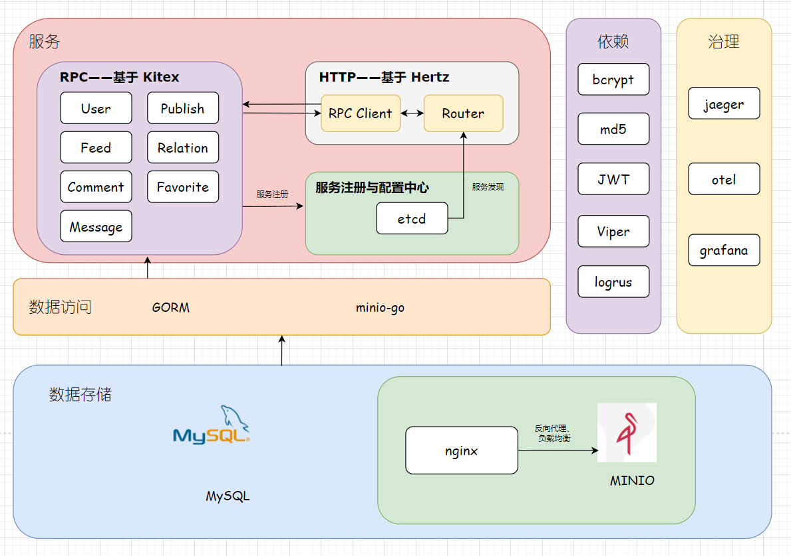
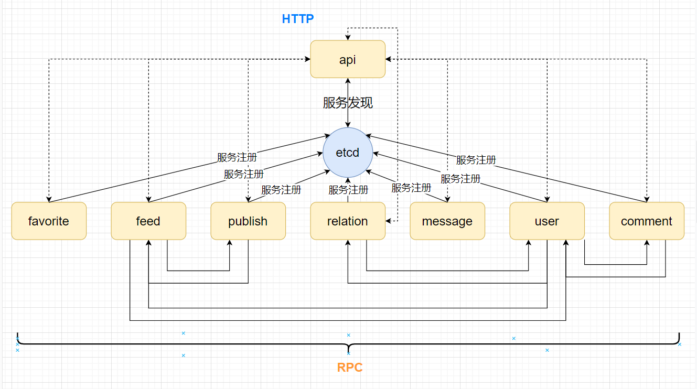
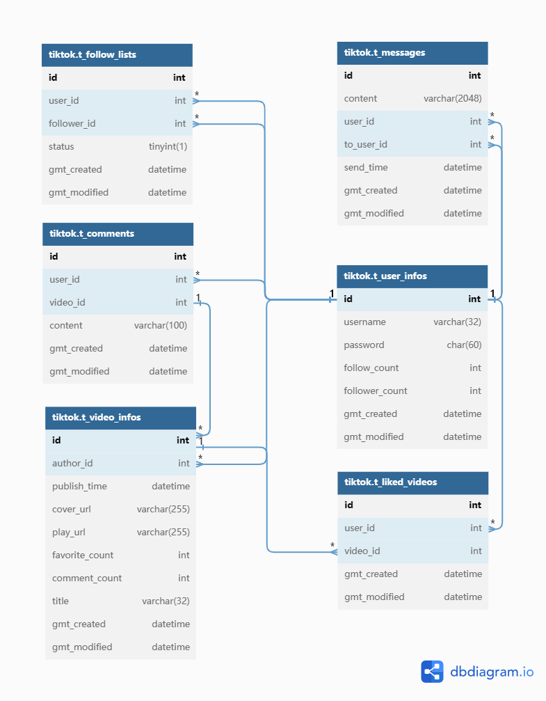

# 一、项目介绍

> 基于 Hertz+Kitex+gorm+etcd 服务注册发现实现的微服务架构后端服务，使用 JWT 进行用户权限验证，通过 minio 集群和 MySQL 进行持久化的简易抖音项目，完整实现了基础功能、互动功能和社交功能
>
>
> Github  地址：https://github.com/PICOF/simple-tiktok
>

## 快速开始

### 配置基础环境

```bash
docker-compose up
```

### 统一编译

```bash
./start.sh build
```

### 统一运行

```bash
./start.sh start
```

### Jaeger

浏览器访问 [http://127.0.0.1:16686/](http://127.0.0.1:16686/)

### Grafana

浏览器访问 [http://127.0.0.1:3000/](http://127.0.0.1:3000/)

# 二、项目实现

### 2.1 技术选型与相关开发文档

Hertz 框架底层采用 netpoll 库相比与传统的 go net 速度更快效率更高，而 gin 框架和 beego 框架则只能使用 go net，考虑本次项目存在多模块多服务且相互有所关联的特性，使用了 Kitex 微服务框架，并为了方便服务调用选择使用 etcd 进行服务注册发现，同时也方便其服务节点的扩展。视频文件存储使用 minio，其高可用和效率都比使用静态文件存储更优，更适合短视频平台的特性，考虑可能会有大量视频访问请求（且短视频平台最多的请求应该就是对于视频文件的请求），应当使用集群部署，并通过 nginx 进行反向代理缓解节点压力

### 2.2 架构设计

主体架构为微服务架构，主要考虑各个功能点相互独立且相互调用，通过 etcd 服务注册发现确定地址并使用 RPC 获取服务。考虑大量的短视频请求，视频存储使用了 minio 对象存储，部署了相关集群，并通过 nginx 进行反向代理与负载均衡，防止出现某一节点请求过高而崩溃。在微服务架构上为了解决对问题的定位与追踪，使用了 otel 进行链路追踪

### 整体架构



### 调用关系



### 数据库 E-R 图



对于数据查询优化和数据约束，我们加入了一些索引以方便查询和约束：

| 索引类型 | 所属表 | 涉及字段 |
| --- | --- | --- |
| 普通 | t_comments | video_id |
| 唯一 | t_follow_lists | user_id、follower_id |
| 唯一 | t_liked_videos | user_id、video_id |
| 普通 | t_messages | user_id、to_user_id、send_time |
| 唯一 | t_user_infos | username |

### 2.3 项目代码介绍

### 项目结构

```
.
├── LICENSE
├── README.md
├── api
├── cmd
│   ├── api
│   │   ├── Makefile
│   │   ├── api
│   │   ├── biz：Hertz 后端业务代码
│   │   │   ├── handler
│   │   │   │   ├── ping.go
│   │   │   │   └── tiktokapi：相关服务逻辑
│   │   │   │       ├── comment_service.go
│   │   │   │       ├── favorite_service.go
│   │   │   │       ├── feed_service.go
│   │   │   │       ├── message_service.go
│   │   │   │       ├── publish_service.go
│   │   │   │       ├── relation_service.go
│   │   │   │       └── user_service.go
│   │   │   ├── model
│   │   │   │   └── tiktokapi
│   │   │   │       └── api.go
│   │   │   ├── mw：中间件
│   │   │   │   ├── bcrypt.go：加密中间件
│   │   │   │   ├── check.go：部分参数校验中间件
│   │   │   │   └── jwt.go：jwt 中间件
│   │   │   ├── router
│   │   │   │   ├── register.go
│   │   │   │   └── tiktokapi
│   │   │   │       ├── api.go
│   │   │   │       └── middleware.go
│   │   │   └── rpc：rpc 交互逻辑
│   │   │       ├── comment
│   │   │       │   └── comment.go
│   │   │       ├── favorite
│   │   │       │   └── favorite.go
│   │   │       ├── feed
│   │   │       │   └── feed.go
│   │   │       ├── message
│   │   │       │   └── message.go
│   │   │       ├── publish
│   │   │       │   └── publish.go
│   │   │       ├── relation
│   │   │       │   └── relation.go
│   │   │       └── user
│   │   │           └── user.go
│   │   ├── main.go
│   │   ├── nohup.out
│   │   ├── router.go
│   │   └── router_gen.go
│   ├── comment：评论微服务
│   │   ├── build.sh
│   │   ├── comment_output.log
│   │   ├── commentaction
│   │   │   ├── action.go：评论发表
│   │   │   ├── convert.go：相关数据转换
│   │   │   └── list.go：评论列表相关逻辑
│   │   ├── handler.go
│   │   ├── kitex.yaml
│   │   ├── log
│   │   │   ├── app
│   │   │   └── rpc
│   │   ├── main.go
│   │   ├── nohup.out
│   │   ├── output
│   │   │   ├── bin
│   │   │   │   └── comment
│   │   │   ├── bootstrap.sh
│   │   │   ├── comment_output.log
│   │   │   └── log
│   │   │       ├── app
│   │   │       └── rpc
│   │   ├── rpc：远程服务调用
│   │   │   └── user.go
│   │   └── script
│   │       └── bootstrap.sh
│   ├── constant：常量
│   │   ├── config.go
│   │   └── status.go
│   ├── favorite：点赞微服务
│   │   ├── build.sh
│   │   ├── favorite_output.log
│   │   ├── favoriteaction
│   │   │   ├── action.go：点赞操作
│   │   │   ├── convert.go：数据转换
│   │   │   └── list.go：相关列表获取
│   │   ├── handler.go
│   │   ├── kitex.yaml
│   │   ├── log
│   │   │   ├── app
│   │   │   └── rpc
│   │   ├── main.go
│   │   ├── nohup.out
│   │   ├── output
│   │   │   ├── bin
│   │   │   │   └── favorite
│   │   │   ├── bootstrap.sh
│   │   │   └── log
│   │   │       ├── app
│   │   │       └── rpc
│   │   └── script
│   │       └── bootstrap.sh
│   ├── feed：视频流微服务
│   │   ├── Makefile
│   │   ├── build.sh
│   │   ├── feed_output.log
│   │   ├── feedaction
│   │   │   ├── convert.go：数据转换
│   │   │   ├── feed_service.go：相关业务逻辑
│   │   │   └── pack.go：返回响应打包
│   │   ├── handler.go
│   │   ├── kitex.yaml
│   │   ├── log
│   │   │   ├── app
│   │   │   └── rpc
│   │   ├── main.go
│   │   ├── nohup.out
│   │   ├── output
│   │   │   ├── bin
│   │   │   │   └── feed
│   │   │   ├── bootstrap.sh
│   │   │   ├── feed_output.log
│   │   │   └── log
│   │   │       ├── app
│   │   │       └── rpc
│   │   ├── rpc：远程服务调用
│   │   │   └── user.go
│   │   └── script
│   │       └── bootstrap.sh
│   ├── message：消息微服务
│   │   ├── build.sh
│   │   ├── handler.go
│   │   ├── kitex.yaml
│   │   ├── log
│   │   │   ├── app
│   │   │   └── rpc
│   │   ├── main.go
│   │   ├── message_output.log
│   │   ├── messageaction
│   │   │   ├── record.go：获取消息记录
│   │   │   └── send.go：发送消息
│   │   ├── nohup.out
│   │   ├── output
│   │   │   ├── bin
│   │   │   │   └── message
│   │   │   ├── bootstrap.sh
│   │   │   └── log
│   │   │       ├── app
│   │   │       └── rpc
│   │   └── script
│   │       └── bootstrap.sh
│   ├── publish：发布微服务
│   │   ├── build.sh
│   │   ├── handler.go
│   │   ├── kitex.yaml
│   │   ├── main.go
│   │   ├── nohup.out
│   │   ├── output
│   │   │   ├── bin
│   │   │   │   └── publish
│   │   │   ├── bootstrap.sh
│   │   │   └── log
│   │   │       ├── app
│   │   │       └── rpc
│   │   ├── publish_output.log
│   │   ├── publishaction
│   │   │   ├── action.go：发布操作
│   │   │   ├── list.go：获取相关列表
│   │   │   └── pack.go：返回响应打包
│   │   ├── rpc：远程服务调用
│   │   │   └── feed.go
│   │   └── script
│   │       └── bootstrap.sh
│   ├── relation：关系微服务
│   │   ├── build.sh
│   │   ├── handler.go
│   │   ├── kitex.yaml
│   │   ├── main.go
│   │   ├── nohup.out
│   │   ├── output
│   │   │   ├── bin
│   │   │   │   └── relation
│   │   │   ├── bootstrap.sh
│   │   │   └── log
│   │   │       ├── app
│   │   │       └── rpc
│   │   ├── relation_output.log
│   │   ├── relationaction
│   │   │   ├── action.go：进行涉及关系变更的操作
│   │   │   └── list.go：获取相关关系列表
│   │   ├── rpc：远程服务调用
│   │   │   └── user.go
│   │   └── script
│   │       └── bootstrap.sh
│   └── user：用户微服务
│       ├── build.sh
│       ├── handler.go
│       ├── kitex.yaml
│       ├── main.go
│       ├── nohup.out
│       ├── output
│       │   ├── bin
│       │   │   └── user
│       │   ├── bootstrap.sh
│       │   ├── log
│       │   │   ├── app
│       │   │   └── rpc
│       │   └── user_output.log
│       ├── script
│       │   └── bootstrap.sh
│       ├── user_output.log
│       └── useraction
│           ├── convert.go：数据转换
│           ├── info.go：获取用户信息
│           ├── pack.go：返回响应打包
│           ├── store.go：写入用户信息
│           └── verify.go：验证用户身份
├── comment_output.log
├── config：相关配置文件
│   ├── jwt.yaml
│   ├── logger.yaml
│   ├── minio.yaml
│   ├── mysql.yaml
│   ├── nginx.conf
│   ├── otel-collector-config.yaml
│   ├── redis.yaml
│   └── service.yaml
├── dal：数据访问层
│   ├── db.go
│   ├── minio：minio 数据访问
│   │   ├── big_buck_bunny.mp4
│   │   ├── init.go：初始化
│   │   ├── minio_test.go
│   │   └── operation.go：数据相关交互操作
│   ├── operation：数据库交互操作
│   │   ├── comment.go：评论信息数据访问
│   │   ├── entity.go：数据库访问数据类型
│   │   ├── favorite.go：点赞数据访问
│   │   ├── favorite_test.go
│   │   ├── feed.go：视频流视频列表数据访问
│   │   ├── message.go：消息数据访问
│   │   ├── message_test.go
│   │   ├── publish.go：视频数据访问
│   │   ├── relation.go：用户关系数据访问
│   │   ├── relation_test.go
│   │   └── user.go：用户信息数据访问
│   └── redis
│       └── init.go
├── docker-compose.yaml：项目依赖环境的容器配置
├── go.mod
├── go.sum
├── idl：接口定义文档
│   ├── api.thrift
│   ├── comment.thrift
│   ├── favorite.thrift
│   ├── feed.thrift
│   ├── message.thrift
│   ├── publish.thrift
│   ├── relation.thrift
│   └── user.thrift
├── kitex_gen：框架自动生成的客户端代码
│   ├── comment
│   │   ├── comment.go
│   │   ├── commentservice
│   │   │   ├── client.go
│   │   │   ├── commentservice.go
│   │   │   ├── invoker.go
│   │   │   └── server.go
│   │   ├── k-comment.go
│   │   └── k-consts.go
│   ├── favorite
│   │   ├── favorite.go
│   │   ├── favoriteservice
│   │   │   ├── client.go
│   │   │   ├── favoriteservice.go
│   │   │   ├── invoker.go
│   │   │   └── server.go
│   │   ├── k-consts.go
│   │   └── k-favorite.go
│   ├── feed
│   │   ├── feed.go
│   │   ├── feedservice
│   │   │   ├── client.go
│   │   │   ├── feedservice.go
│   │   │   ├── invoker.go
│   │   │   └── server.go
│   │   ├── k-consts.go
│   │   └── k-feed.go
│   ├── message
│   │   ├── k-consts.go
│   │   ├── k-message.go
│   │   ├── message.go
│   │   └── messageservice
│   │       ├── client.go
│   │       ├── invoker.go
│   │       ├── messageservice.go
│   │       └── server.go
│   ├── publish
│   │   ├── k-consts.go
│   │   ├── k-publish.go
│   │   ├── publish.go
│   │   └── publishservice
│   │       ├── client.go
│   │       ├── invoker.go
│   │       ├── publishservice.go
│   │       └── server.go
│   ├── relation
│   │   ├── k-consts.go
│   │   ├── k-relation.go
│   │   ├── relation.go
│   │   └── relationservice
│   │       ├── client.go
│   │       ├── invoker.go
│   │       ├── relationservice.go
│   │       └── server.go
│   └── user
│       ├── k-consts.go
│       ├── k-user.go
│       ├── user.go
│       └── userservice
│           ├── client.go
│           ├── invoker.go
│           ├── server.go
│           └── userservice.go
├── message_output.log
├── output
│   └── bin
├── pkg：项目使用的相关工具
│   ├── bcrypt
│   │   ├── bcrypt.go
│   │   └── bcrypt_test.go
│   ├── config：读取配置
│   │   ├── config.go
│   │   └── config_test.go
│   ├── cover：视频封面获取工具
│   │   └── frame.go
│   ├── jwt：jwt 工具
│   │   ├── jwt.go
│   │   └── jwt_test.go
│   ├── logger：日志工具
│   │   ├── init.go：初始化
│   │   └── logger.go：获取及相关逻辑
│   ├── md5：md5 加密工具
│   │   └── md5util.go
│   └── mw：微服务中间件
│       ├── client.go
│       ├── common.go
│       └── server.go
├── start.sh：统一构建与运行脚本
└── tiktok_data：项目数据库 sql 文件
            └── init.sql：项目数据库初始化 DDL 语句

```

### 重要代码模块

| 代码模块 | 主要功能 | 相关介绍 | 框架支持 | 传输协议 |
| --- | --- | --- | --- | --- |
| api | 接收客户端请求，返回服务响应 | 对用户请求进行接收并进行路由处理，调用微服务能力返回结果 | Hertz、Kitex | HTTP 协议、Thrift 协议 |
| user | 查询用户信息、用户登录、用户注册 | 处理用户个人相关的微服务 | Kitex、GORM | Thrift 协议 |
| feed | 获取视频流 | 从对应数据库中获取视频列表，会调用 user 等其它微服务 | Kitex、GORM | Thrift 协议 |
| favorite | 点赞、获取点赞列表 | 在获取点赞列表时会调用 user 等其它微服务 | Kitex、GORM | Thrift 协议 |
| comment | 发表及删除评论、获取评论列表 | 获取评论列表不要求身份验证，发表及删除需要登录 | Kitex、GORM | Thrift 协议 |
| message | 聊天功能 | 获取聊天记录时通过客户端传递的参数获取最新消息 | Kitex、GORM | Thrift 协议 |
| relation | 处理用户关系 | 单向关注判定为粉丝，双向关注判定为好友 | Kitex、GORM | Thrift 协议 |
| publish | 上传发布视频 | 存入 minio 集群并获取视频地址，截取视频第一帧作为封面 | Kitex、GORM | Thrift 协议 |
| pkg | 为具体业务功能实现提供工具 | 包含 jwt、bcrypt、配置读取、封面获取的工具代码 |  |  |
| rpc | 提供 rpc client | 初始化 rpc 服务所需的客户端 | Kitex | Thrift 协议 |

### 主要中间件

### Jwt

```go
func JWTHandler() app.HandlerFunc {
   return func(ctx context.Context, c *app.RequestContext) {
      var token string
      form, _ := c.MultipartForm()
      if form != nil {
         v := form.Value["token"]
         if v != nil {
            token = v[0]
         } else {
            code, msg := constant.Failed.GetInfo()
            c.AbortWithStatusJSON(http.StatusBadRequest, checkFailed{StatusCode: code, StatusMessage: msg})
         }
      } else {
         token = c.Query("token")
      }
      path := string(c.Path())
      if token != "" || (path == "/douyin/publish/action/" || path == "/douyin/favorite/action/" || path == "/douyin/comment/action/" || path == "/douyin/relation/action/" || path == "/douyin/message/action/" || path == "/douyin/message/chat/") {
         parseToken, err := jwt.JWTUtil.ParseToken(token)
         if err != nil {
            code, msg := constant.Failed.GetInfo()
            c.AbortWithStatusJSON(http.StatusBadRequest, checkFailed{StatusCode: code, StatusMessage: msg})
         } else {
            c.Set("user_id", parseToken.UserId)
         }
      }
      c.Next(ctx)
   }
}

```

该中间件依赖于 pkg 中的 jwt 相关代码：

```go
const ConfigName = "jwt"

var (
   TokenInvalid     = errors.New("couldn't handle this token")
   JWTConfig        *viper.Viper
   expire           time.Duration
   JWTUtil          *JWT
)

type JWT struct {
   SignKey []byte
}

type CustomClaims struct {
   UserId int64
   jwt.RegisteredClaims
}

func init() {
   JWTConfig = config.GetConfig(ConfigName)
   expire = JWTConfig.GetDuration("timeout")
   JWTUtil = NewJWT()
}

func NewJWT() *JWT {
   return &JWT{
      []byte(JWTConfig.GetString("secretKey")),
   }
}

func (j *JWT) CreateToken(userId int64) (string, error) {
   startTime := time.Now().Add(-time.Second)
   claims := CustomClaims{
      UserId: userId,
      RegisteredClaims: jwt.RegisteredClaims{
         NotBefore: jwt.NewNumericDate(startTime),             // 签名生效时间
         ExpiresAt: jwt.NewNumericDate(startTime.Add(expire)), // 过期时间 7天  配置文件
         Issuer:    JWTConfig.GetString("issuer"),             // 签名的发行者
      },
   }
   token := jwt.NewWithClaims(jwt.SigningMethodHS256, claims)
   return token.SignedString(j.SignKey)
}

func (j *JWT) ParseToken(tokenString string) (*CustomClaims, error) {
   token, err := jwt.ParseWithClaims(tokenString, &CustomClaims{}, func(token *jwt.Token) (i interface{}, e error) {
      return j.SignKey, nil
   })
   if err != nil {
      return nil, err
   }
   if token != nil {
      if claims, ok := token.Claims.(*CustomClaims); ok && token.Valid {
         return claims, nil
      }
      return nil, TokenInvalid

   } else {
      return nil, TokenInvalid
   }
}

```

该中间件对部分接口进行身份验证，部分接口则不验证身份只解析 token

### Check

该中间件对部分对格式长度有要求的参数进行了相关检验，比如用户名密码、消息和发布信息

```go
type checkFailed struct {
   StatusCode    int64  `json:"status_code"`
   StatusMessage string `json:"status_msg"`
}

const publishType = "1"

func LengthCheck() app.HandlerFunc {
   return func(ctx context.Context, c *app.RequestContext) {
      password := c.Query("password")
      username := c.Query("username")
      lp := len(password)
      ln := len([]rune(username))
      if ln == 0 || lp == 0 || lp < 6 || ln > 32 || lp > 32 {
         code, msg := constant.Failed.GetInfo()
         c.AbortWithStatusJSON(http.StatusBadRequest, checkFailed{StatusCode: code, StatusMessage: msg})
      }
      c.Next(ctx)
   }
}

func PublishCheck() app.HandlerFunc {
   return func(ctx context.Context, c *app.RequestContext) {
      form, err := c.MultipartForm()
      file, err := c.FormFile("data")
      if err != nil || form == nil || len([]rune(form.Value["title"][0])) > 32 || file == nil {
         code, msg := constant.Failed.GetInfo()
         c.AbortWithStatusJSON(http.StatusBadRequest, checkFailed{StatusCode: code, StatusMessage: msg})
      }
      open, err := file.Open()
      if err != nil {
         code, msg := constant.Failed.GetInfo()
         c.AbortWithStatusJSON(http.StatusBadRequest, checkFailed{StatusCode: code, StatusMessage: msg})
      }
      data := make([]byte, file.Size)
      _, err = open.Read(data)
      if err != nil {
         code, msg := constant.Failed.GetInfo()
         c.AbortWithStatusJSON(http.StatusBadRequest, checkFailed{StatusCode: code, StatusMessage: msg})
      }
      c.Set("data", data)
      c.Next(ctx)
   }
}
func CommentCheck() app.HandlerFunc {
   return func(ctx context.Context, c *app.RequestContext) {
      if c.Query("action_type") == publishType {
         text := c.Query("comment_text")
         length := len([]rune(text))
         if length == 0 || length > 100 {
            code, msg := constant.Failed.GetInfo()
            c.AbortWithStatusJSON(http.StatusBadRequest, checkFailed{StatusCode: code, StatusMessage: msg})
         }
      }
      c.Next(ctx)
   }
}
func MessageCheck() app.HandlerFunc {
   return func(ctx context.Context, c *app.RequestContext) {
      content := c.Query("content")
      length := len([]rune(content))
      if length == 0 || length > 2048 {
         code, msg := constant.Failed.GetInfo()
         c.AbortWithStatusJSON(http.StatusBadRequest, checkFailed{StatusCode: code, StatusMessage: msg})
      }
      c.Next(ctx)
   }
}

```

### 主要工具类

### bcrypt

Bcrypt 对密码进行处理后存入数据库，增强数据安全性，增大攻击者的破解成本，保证用户数据安全

```go
func EncryptPassword(ctx context.Context, password string) (result []byte, err error) {
   result, err = bcrypt.GenerateFromPassword([]byte(password), bcrypt.DefaultCost)
   if err != nil {
      klog.CtxErrorf(ctx, "An error occurred while encrypting the password: %v", err)
      return nil, err
   }
   return
}
func ComparePassword(hash string, password string) bool {
   err := bcrypt.CompareHashAndPassword([]byte(hash), []byte(password))
   return err == nil
}

```

### md5

主要用于对获取视频文件 md5 值，保证存入文件名不会产生严重冲突，并防止重复文件多次上传浪费空间

```go
func GetFileMd5(content []byte) (string, error) {
   md5h := md5.New()
   _, err := io.Copy(md5h, bytes.NewReader(content))
   if err != nil {
      return "", err
   }
   return hex.EncodeToString(md5h.Sum(nil)), nil
}

```

### config

配置文件采用 viper 进行读取，支持远程配置文件读取，后续检查更改逻辑可以在获取后进行

```go
func GetConfig(configName string) (v *viper.Viper) {
   v = viper.New()
   v.SetConfigName(configName)
   v.AddConfigPath(".")
   v.AddConfigPath("./config")
   v.AddConfigPath("../../config")
   v.AddConfigPath("../../../config")
   err := v.ReadInConfig()
   if err != nil {
      panic(fmt.Errorf("Fatal error config file: %s \n", err))
   }
   v.WatchConfig()
   return
}

```

### Jwt

同上部分展示代码

### 数据访问层

几个模块基本相似，都是以 gorm 提供的方法作为基础进行开发，并结合实际数据库数据编写合适的代码，比如以下列 relation 模块代码为例，数据库中为了节省查询时间，设计时加入了是否是双向关注的标志位以应对读多写少的情境，而在修改数据时就需要保证前后一致性，因此该操作被划分为多步并使用事务进行提交

### 相关代码

```go
func IsFollow(ctx context.Context, userId int64, followerId int64) (res bool, err error) {
   if userId == followerId {
      res = false
      return
   }
   err = dal.DB.WithContext(ctx).Where("user_id = ? AND follower_id = ?", userId, followerId).First(&TFollowList{}).Error
   if err != nil {
      if err == gorm.ErrRecordNotFound {
         return false, nil
      }
      return
   }
   res = true
   return
}
func FollowAction(ctx context.Context, userId int64, toUserId int64) (err error) {
   err = dal.DB.Transaction(func(tx *gorm.DB) error {
      var follow TFollowList
      var status bool
      err = tx.Clauses(clause.Locking{Strength: "UPDATE"}).
         Where("user_id = ? AND follower_id = ?", userId, toUserId).
         First(&follow).
         Error
      if err != nil && err.Error() != "record not found" {
         return err
      }
      if err == nil {
         status = true
         tx.Model(&follow).Update("status", status)
      }
      err = tx.WithContext(ctx).Create(&TFollowList{
         UserId:     toUserId,
         FollowerId: userId,
         Status:     status,
      }).Error
      if err != nil {
         return err
      }
      err = tx.Model(&TUserInfo{
         PublicAttr: PublicAttr{
            Id: userId,
         },
      }).UpdateColumn("follow_count", gorm.Expr("follow_count + ?", 1)).Error
      if err != nil {
         return err
      }
      err = tx.Model(&TUserInfo{
         PublicAttr: PublicAttr{
            Id: toUserId,
         },
      }).UpdateColumn("follower_count", gorm.Expr("follower_count + ?", 1)).Error
      if err != nil {
         return err
      }
      return nil
   })
   return
}
func UnfollowAction(ctx context.Context, userId int64, toUserId int64) (err error) {
   err = dal.DB.Transaction(func(tx *gorm.DB) error {
      var follow TFollowList
      err = tx.Clauses(clause.Locking{Strength: "UPDATE"}).
         Where("user_id = ? AND follower_id = ?", userId, toUserId).
         First(&follow).
         Error
      if err != nil && err.Error() != "record not found" {
         return err
      }
      if err == nil {
         tx.Model(&follow).Update("status", false)
      }
      result := tx.WithContext(ctx).Where("user_id = ? AND follower_id = ?", toUserId, userId).Delete(&TFollowList{})
      if result.Error != nil || result.RowsAffected == 0 {
         return errors.New("failed to find follow record")
      }
      err = tx.Model(&TUserInfo{
         PublicAttr: PublicAttr{
            Id: userId,
         },
      }).UpdateColumn("follow_count", gorm.Expr("follow_count - ?", 1)).Error
      if err != nil {
         return err
      }
      err = tx.Model(&TUserInfo{
         PublicAttr: PublicAttr{
            Id: toUserId,
         },
      }).UpdateColumn("follower_count", gorm.Expr("follower_count - ?", 1)).Error
      if err != nil {
         return err
      }
      return nil
   })
   return
}

func GetFollowList(ctx context.Context, userId int64) (list []TFollowList, err error) {
   err = dal.DB.WithContext(ctx).Where("follower_id = ?", userId).Find(&list).Error
   if err != nil {
      return
   }
   return
}

func GetFollowerList(ctx context.Context, userId int64) (list []TFollowList, err error) {
   err = dal.DB.WithContext(ctx).Where("user_id = ?", userId).Find(&list).Error
   if err != nil {
      return
   }
   return
}

func GetFriendList(ctx context.Context, userId int64) (list []TFollowList, err error) {
   err = dal.DB.WithContext(ctx).Where("user_id = ? AND status = ?", userId, true).Find(&list).Error
   if err != nil {
      return
   }
   return
}

```

### 相关结构体

使用结构体进行数据库操作

```go
type PublicAttr struct {
   Id          int64
   GmtModified time.Time `gorm:"autoUpdateTime"`
}

type TVideoInfo struct {
   AuthorId      int64
   PublishTime   time.Time
   CoverUrl      string
   PlayUrl       string
   FavoriteCount int64
   CommentCount  int64
   Title         string
   PublicAttr
}

type TUserInfo struct {
   Username      string
   Password      string
   FollowCount   int64
   FollowerCount int64
   PublicAttr
}

type TFollowList struct {
   UserId     int64
   FollowerId int64
   Status     bool
   PublicAttr
}

type TLikedVideo struct {
   UserId  int64
   VideoId int64
   PublicAttr
}

type TComment struct {
   UserId     int64
   VideoId    int64
   Content    string
   GmtCreated time.Time
   PublicAttr
}

type TMessage struct {
   UserId   int64
   ToUserId int64
   Content  string
   SendTime time.Time
   PublicAttr
}

```

### 远程过程调用

通过 etcd 获取服务地址，再初始化相关 client 进行服务访问，使用链路追踪保证流量可查

### user

```go
var Client userservice.Client

func init() {
   InitUser()
}

func InitUser() {
   r, err := etcd.NewEtcdResolver(constant.ETCDAddress)
   if err != nil {
      panic(err)
   }
   provider.NewOpenTelemetryProvider(
      provider.WithServiceName(constant.RelationServiceName),
      provider.WithExportEndpoint(constant.ExportEndpoint),
      provider.WithInsecure(),
   )
   c, err := userservice.NewClient(
      constant.UserServiceName,
      client.WithResolver(r),
      client.WithMuxConnection(1),
      client.WithMiddleware(mw.CommonMiddleware),
      client.WithInstanceMW(mw.ClientMiddleware),
      client.WithSuite(tracing.NewClientSuite()),
      client.WithClientBasicInfo(&rpcinfo.EndpointBasicInfo{ServiceName: constant.RelationServiceName}),
   )
   if err != nil {
      panic(err)
   }
   Client = c
}

func GetUserInfo(ctx context.Context, userId int64, queryId int64) (userInfo *user.UserInfo, err error) {
   var rpcReq = &user.UserInfoRequest{
      UserId:  userId,
      QueryId: queryId,
   }
   var resp *user.UserInfoResponse
   resp, err = Client.GetUserInfo(ctx, rpcReq)
   if err != nil {
      klog.CtxErrorf(ctx, "Failed to get user info: %v", err)
      return
   }
   userInfo = resp.User
   return
}

```

### feed

```go
var Client feedservice.Client

func init() {
   InitFeed()
}

func InitFeed() {
   r, err := etcd.NewEtcdResolver(constant.ETCDAddress)
   if err != nil {
      panic(err)
   }
   provider.NewOpenTelemetryProvider(
      provider.WithServiceName(constant.PublishServiceName),
      provider.WithExportEndpoint(constant.ExportEndpoint),
      provider.WithInsecure(),
   )
   c, err := feedservice.NewClient(
      constant.FeedServiceName,
      client.WithResolver(r),
      client.WithMuxConnection(1),
      client.WithMiddleware(mw.CommonMiddleware),
      client.WithInstanceMW(mw.ClientMiddleware),
      client.WithSuite(tracing.NewClientSuite()),
      client.WithClientBasicInfo(&rpcinfo.EndpointBasicInfo{ServiceName: constant.PublishServiceName}),
   )
   if err != nil {
      panic(err)
   }
   Client = c
}

func GetVideoListById(ctx context.Context, userId int64, queryId int64) (videoInfo []*feed.VideoInfo, err error) {
   var rpcReq = &feed.GetByIDRequest{
      UserId:  userId,
      QueryId: queryId,
   }
   var resp *feed.FeedResponse
   resp, err = Client.GetVideoListById(ctx, rpcReq)
   if err != nil {
      klog.CtxErrorf(ctx, "Failed to get video by id: %v", err)
      return
   }
   videoInfo = resp.VideoList
   return
}

```

其它可在项目中的所有 rpc 文件夹下查看

# 三、测试结果

> 建议从功能测试和性能测试两部分分析，其中功能测试补充测试用例，性能测试补充性能分析报告、可优化点等内容。
>

## **3.1 登录**

**该板块实现了对用户的登录，判断是否为录入用户，若是则进入信息页面，若不是则登陆失败。**

| 测试对象 | 输入 | 数据类型 | 测试前提 | 期望结果 | 输出 |
| --- | --- | --- | --- | --- | --- |
| 账号 | user | 字符串 | 用户存在且密码正确 | 登录成功 | 登录成功 |
| 账号 | user123 | 字符串+数字 | 用户存在且密码正确 | 登录成功 | 登录成功 |
| 账号 | $$#*9^% | 特殊字符 | 用户不存在 | 登录失败 | 登录失败 |

## 3.2 注册

| 测试对象 | 输入 | 数据类型 | 测试前提 | 期望结果 | 输出 |
| --- | --- | --- | --- | --- | --- |
| 账号 | user88 | 字符串 | 用户不存在且密码合法 | 注册成功 | 注册成功 |
| 账号 | user114514 | 字符串+数字 | 用户存在且密码正确 | 注册成功 | 注册成功 |
| 账号 | $$#*9^% | 特殊字符 | 用户名不合法 | 注册失败 | 注册失败 |

## 3.3 用户信息查看

| 测试对象 | 测试前提 | 期望结果 | 输出 |
| --- | --- | --- | --- |
| 账号 | 用户已经登录 | 用户uesr的信息 | 用户user的信息 |
| 账号 | 用户未登录 | 没有输出 | 无 |

## 3.4 投稿接口

| 测试对象 | 测试前提 | 期望结果 | 输出 |
| --- | --- | --- | --- |
| 账号 | 用户已经登录 | 能够发布视频 | 用户发布视频成功 |
| 账号 | 用户未登录 | 无法发布视频 | 无法发布视频 |

## 3.4 赞操作

| 测试对象 | 测试前提 | 期望结果 | 输出 |
| --- | --- | --- | --- |
| 账号 | 用户已经登录，视频未点赞 | 视频点赞数+1 | 视频点赞数+1 |
| 账号 | 用户已经登录，视频已经点赞 | 视频点赞数-1 | 视频点赞数-1 |
| 账号 | 用户未登录 | 点赞失败 | 点赞失败 |

## 3.5 喜欢列表

| 测试对象 | 测试前提 | 期望结果 | 输出 |
| --- | --- | --- | --- |
| 账号 | 用户已经登录 | 能够看到自己点赞过的视频 | 点赞过的视频 |
| 账号 | 用户未登录 | 无法看到点赞过的视频 | 无法看到点赞过的视频 |

## 3.6 评论

| 测试对象 | 测试前提 | 输入 | 期望结果 | 输出 |
| --- | --- | --- | --- | --- |
| 账号 | 用户已经登录 | 123456xyz | 能够评论 | 评论内容 |
| 账号 | 用户未登录 | 123456xyz | 无法发布视频评论 | 无法发布视频评论 |

## 3.7 关注

| 测试对象 | 测试前提 | 期望结果 | 输出 |
| --- | --- | --- | --- |
| 账号 | 用户已经登录 | 关注成功 | 关注成功 |
| 账号 | 用户未登录 | 无法关注 | 无法关注 |

## 3.8 关注列表

| 测试对象 | 测试前提 | 期望结果 | 输出 |
| --- | --- | --- | --- |
| 账号 | 用户已经登录 | 能够看到自己关注的人 | 能够看到自己关注的人 |
| 账号 | 用户未登录 | 无法看到自己关注的人 | 无法看到自己关注的人 |

## 3.9 粉丝列表

| 测试对象 | 测试前提 | 期望结果 | 输出 |
| --- | --- | --- | --- |
| 账号 | 用户已经登录 | 能够看到关注自己的人 | 能够看到关注自己的人 |
| 账号 | 用户未登录 | 无法看到关注自己的人 | 无法看到关注自己的人 |

## 3.10 好友列表

| 测试对象 | 测试前提 | 期望结果 | 输出 |
| --- | --- | --- | --- |
| 账号 | 用户已经登录 | 能够看到好友 | 能够看到好友 |
| 账号 | 用户未登录 | 不能够看到好友 | 不能够看到好友 |

## 3.11 发送消息

| 测试对象 | 测试前提 | 输入 | 期望结果 | 输出 |
| --- | --- | --- | --- | --- |
| 账号 | 用户已经登录 | 123456xyz | 能够发送消息 | 能够发送消息 |
| 账号 | 用户已经登录 | 123456xyz非法字符 | 不能够发送消息 | 不能够发送消息 |
| 账号 | 用户未登录 | 123456xyz | 不能够发送消息 | 不能够发送消息 |

## 3.12 聊天记录

| 测试对象 | 测试前提 | 期望结果 | 输出 |
| --- | --- | --- | --- |
| 账号 | 用户已经登录 | 能够看到聊天记录 | 能够看到聊天记录 |
| 账号 | 用户未登录 | 不能够看到聊天记录 | 不能够看到聊天记录 |

# 四、Demo 演示视频

详见飞书文档

# 五、项目总结与反思

## 目前仍存在的问题

1. 消息显示更改成了依赖前端传入参数，应当设法通过后端逻辑解决
2. 性能测试不够仔细
3. 未实现新增功能（收获点赞数）

## 已识别出的优化项

1. 使用 redis 进行中间缓存，还可以加上本地缓存，优化数据访问速度减少数据库访问开销
2. 路由服务器可以部署多个节点并使用 nginx 进行反向代理
3. 部分中间件有官方提供的实现，部分中间件编写较为简陋
4. 部分节点的部署未写入 docker-compose 文件，可能导致运维较复杂
5. 部分消息可以异步执行，同步执行白白增加了等待时间

## 架构演进的可能性

1. 增加中间缓存，分担数据库压力，提升速度与性能
2. 合理使用 nginx 进行反向代理，缓解单节点处理服务所承受的压力与流量
3. 部分中间件换用官方中间件
4. 加入消息队列，让部分消息处理异步执行，只保证最终一致性

## 项目过程中的反思与总结

1. 部分提前预想的架构由于时间因素未能一一实现
2. 团队内部信息共享可能存在不及时的情况